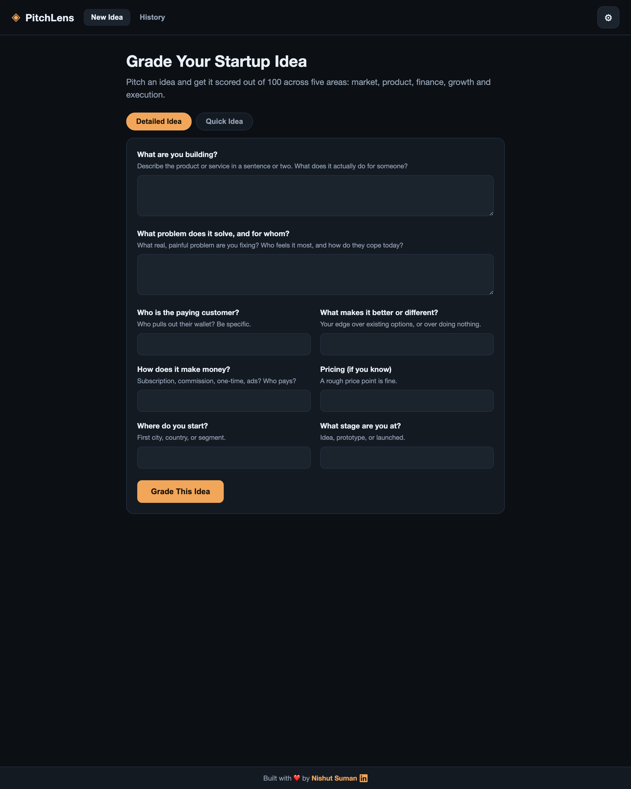
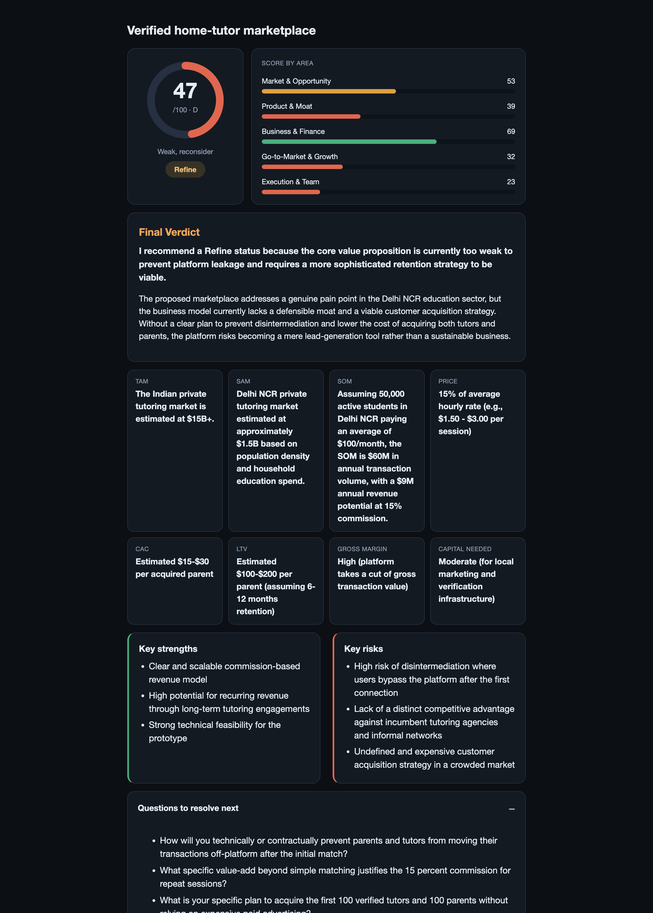

# Startup Idea Grader (PitchLens)

An AI evaluator that grades a startup idea out of 100 across five business areas and returns a
professional, structured verdict. A founder pitches an idea, and the app scores it the way a
seasoned investor would: problem, market, product, moat, finance, go-to-market, and execution.

Built as the assignment for the Program Manager (Technology and AI) role at Mesa School of Business.

> **Deployment note (please read):** On the night this was submitted, GitHub sign-in and every
> third-party Git connector I tried (Render, Railway, Koyeb, Vercel) were failing to authenticate,
> which blocked setting up the hosted link in time. The app runs fully in two commands (see
> [Run locally](#run-locally)), a `Dockerfile` is included so it deploys anywhere once the
> connectors recover, and I am glad to give a live walkthrough on a call.

## Screenshots

**Input (Detailed pitch)**



**Graded report (dashboard)**



## How it works (the flow)

1. **Choose how to enter the idea.** Two modes: a **Detailed pitch** form, or a **Quick idea**
   one-liner.
2. **(Detailed)** Fill the eight fields. **(Quick)** Type one line; the AI proposes three to four
   assumption options for each missing detail, you pick or edit them, and it grades the completed
   version. The report then separates what you told it from what it assumed.
3. **Pick a provider and market mode** in Settings (Gemini, OpenAI, or Anthropic; reasoned
   estimate or grounded with live web data).
4. **Grade.** The backend runs a **five-stage pipeline**, one focused AI prompt per business area.
   Each criterion is scored 0 to 10, the weighted total out of 100 is computed **in code**, and a
   final verdict is written.
5. **Read the dashboard.** A score ring, a score-by-area bar chart, market and finance stat cards,
   key strengths and risks, the questions a panel would ask next, and an expandable full breakdown.
6. **History.** Every evaluation is saved. Open any past idea to see its full report and the exact
   inputs that were submitted.

## Input structure

### Mode A: Detailed pitch (eight fields)

| # | Field | What it captures |
|---|-------|------------------|
| 1 | What are you building? | The product or service in a sentence or two |
| 2 | What problem does it solve, and for whom? | The real, painful problem and who feels it |
| 3 | Who is the paying customer? | Who actually pays (be specific) |
| 4 | What makes it better or different? | The edge over existing options or over doing nothing |
| 5 | How does it make money? | The revenue model and who pays for what |
| 6 | Pricing | A rough price point or model (optional) |
| 7 | Where do you start? | The first city, country, or segment |
| 8 | What stage are you at? | Idea, prototype, or launched |

### Mode B: Quick idea

For a raw one-liner like `alumni management system`, which is too thin to grade fairly, the app
first asks the AI to propose three to four sensible assumptions per missing field. You confirm or
edit them, then it grades the strengthened version and clearly shows what was assumed versus what
you provided.

## How it grades: the rubric

The rubric is hand-written (see [`backend/rubric.py`](backend/rubric.py)); the weights are opinions
about why startups succeed or fail. The view encoded here: most startups die because they build
something nobody urgently needs, so **Problem and Market carry the most weight**. It is a
deliberately tough grader, so an average idea lands near 50, not 80.

### Atomised rubric: 5 stages, 16 criteria, 100 points

| Stage (area) | Criterion | Points | High score | Low score |
|---|---|:--:|---|---|
| **Market and Opportunity (30)** | Problem severity and urgency | 10 | Specific, urgent, frequent pain; people already build workarounds | Vague nice-to-have; nobody is looking for a fix |
| | Market size and growth | 8 | Large or fast-growing market with buyers who will pay | Tiny or shrinking, or no one with budget |
| | Why now (timing) | 5 | A recent shift makes this newly possible or urgent | Could have been built years ago, no reason now |
| | Competition and alternatives | 7 | Clear-eyed on incumbents with a credible angle to win | Claims "no competition" or ignores alternatives |
| **Product and Moat (20)** | Solution and differentiation | 8 | Meaningfully better (about 10x), not a tweak | Barely better, or a feature not a product |
| | Moat and defensibility | 7 | Compounds and resists copying (network effects, data, brand) | Trivially cloneable once it works |
| | Feasibility to build | 5 | Realistically buildable with sane resources | Needs breakthroughs or capabilities the team lacks |
| **Business and Finance (22)** | Business model clarity | 6 | A clear, believable way to charge | No revenue model, or "monetise later" |
| | Unit economics | 9 | Each sale earns more than it costs to win and serve | Loses money per unit with no path to fix |
| | Capital efficiency | 7 | Reaches proof or revenue without huge capital | Needs heavy capital before any validation |
| **Go-to-Market and Growth (16)** | Distribution and marketing | 6 | A specific, affordable channel to the first customers | "Go viral" or "run ads" with no concrete plan |
| | Partnerships and channels | 4 | Credible partners that unlock reach or trust | Depends on partners with no reason to cooperate |
| | Retention and engagement | 6 | A real reason users come back | One-time use, no hook |
| **Execution and Team (12)** | Founder-market fit | 6 | A real edge: insight, experience, or unfair access | No reason this founder wins |
| | Operations and scalability | 4 | Gets easier or cheaper as it grows | Linear, manual effort that gets harder at scale |
| | Red flags and key risks | 2 | Risks acknowledged and addressable | Fatal legal or regulatory risks ignored |

Each criterion is scored 0 to 10, multiplied by its points, and summed **in code** (not by the
model) into a 0 to 100 score.

### Grade bands

| Grade | Score | Meaning |
|:--:|:--:|---|
| A | 85+ | Strong, worth pursuing |
| B | 70 to 84 | Promising, with conditions |
| C | 58 to 69 | Mixed, needs sharpening |
| D | 46 to 57 | Weak, reconsider |
| E | 34 to 45 | Very weak |
| F | below 34 | Pass |

The final verdict also gives a one-word recommendation: **Pursue, Refine, Reconsider, or Pass.**

## Architecture

```
React (Vite)  ->  FastAPI  ->  LLM provider (Gemini / OpenAI / Anthropic)
 input modes      five-stage pipeline     + optional web search (grounding)
 dashboard        weighted score in code, SQLite history
```

Decisions and the reasons behind them:

- **A backend exists to keep the API key server-side** (never in the browser) and to run the
  multi-stage pipeline. That is the justification for the Python service, not gold-plating.
- **One focused prompt per stage**, rather than a single giant prompt, so each area is judged on
  its own terms. This is also where the prompting work shows.
- **The score is computed in code, not by the model**, because language models are unreliable at
  arithmetic. The model scores each criterion; Python does the weighting.
- **Provider fallback:** free Gemini models are individually flaky (retired, quota, or overloaded),
  so the Gemini adapter automatically falls back across several models. This hardens live demos.
- **Grounding is optional and isolated**, so live web data can never crash a grading run.

## Tech stack

- **Frontend:** React, Vite (no UI framework, hand-written CSS, dark theme, inline SVG charts)
- **Backend:** FastAPI, Python, SQLite, rate-limited
- **AI:** Gemini, OpenAI, and Anthropic behind one interface; optional Tavily web search
- **Deploy:** Dockerfile included for any container host

## Run locally

**Backend**
```bash
cd backend
python3 -m venv .venv
./.venv/bin/pip install -r requirements.txt
cp .env.example .env         # add a free GEMINI_API_KEY (or OPENAI / ANTHROPIC)
./.venv/bin/uvicorn main:app --port 8000
```

**Frontend** (a second terminal)
```bash
cd frontend
npm install
npm run dev                  # opens http://localhost:5173
```

Leave the Settings key field blank and the server uses the key from `.env` automatically.

## Deploy (when Git connectors are available)

A `backend/Dockerfile` is included, so the backend runs on any container host (Render, Railway,
Koyeb, Fly, Hugging Face Spaces). Set `GEMINI_API_KEY` and `ALLOWED_ORIGIN` as environment
variables, and point the frontend `VITE_API_URL` at the backend URL.

## Project structure

```
backend/
  rubric.py       the rubric and the per-stage prompts (the thinking)
  pipeline.py     runs the five stages, weighted scoring, synthesis
  providers.py    Gemini / OpenAI / Anthropic behind one interface, with fallback
  grounding.py    optional live web data
  db.py           SQLite history
  main.py         FastAPI app (rate-limited, CORS)
  Dockerfile
frontend/
  src/App.jsx     the UI: input modes, dashboard report, history
  src/styles.css  dark theme
docs/             screenshots
```
